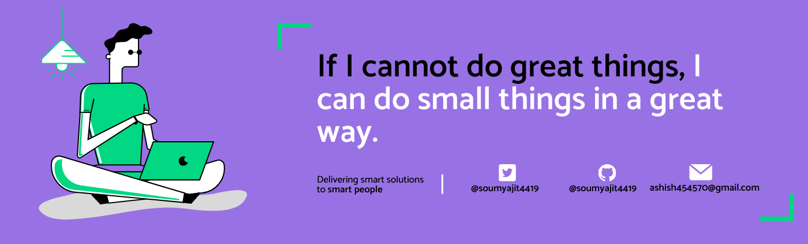

<h1 align="center">Hello I'm Shreyesh Pandey</h1>
<!-- 

  

 -->
  

## 👨🏻‍💻 About Me:

- 🙋‍♂️ All about me is at **[My Website](https://shreyeshpandey.xyz/)**

- 🔭 I’m currently working on `Something Intresting`.

- 🌱 I’m currently learning `Next JS`

- 👯 I’m looking to collaborate for `Dev Projects`

- 🤔 I’m looking for help with `Web3 Development`

## 🛠️ Technologies and Tools I use:

 
 
 

## ❤️ Let's get connected:

   

## 📊 My GitHub Data:

  
  

